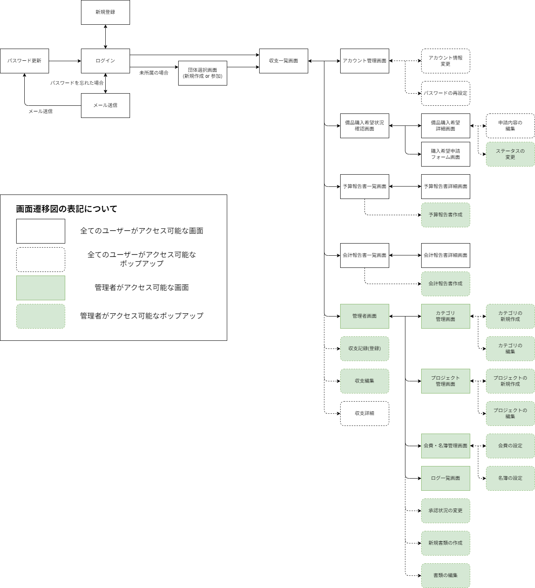
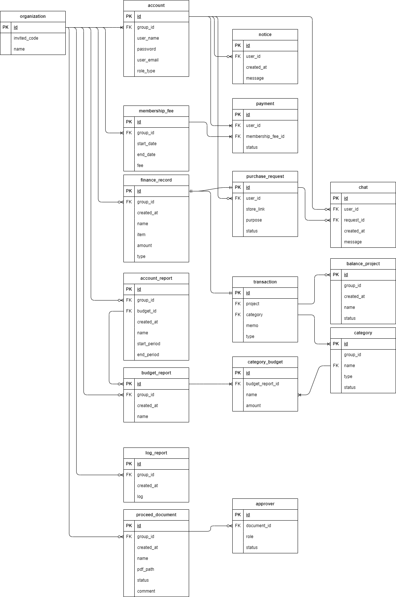

# Spica

学生団体向け会計管理Webアプリケーション

## 目次
- [プロジェクトについて](#プロジェクトについて)
- [企画](#企画)
- [画面遷移図](#画面遷移図)
- [ER図](#er図)
- [ディレクトリ構成](#ディレクトリ構成)
- [ライセンス](#ライセンス)

## プロジェクトについて

大学の課題解決実習(ゼミ)で学んだWebアプリ開発の経験を活かし、個人開発に挑戦したプロジェクトです。

部活動の会計担当として感じた課題を解決するため、学生団体向けの会計管理Webアプリを開発しています。企画から設計、実装、テスト、デプロイまで、実践的な開発フローに沿って実施しています。

### 開発スケジュール
| 時期 | フェーズ | 内容 |
|------|---------|------|
| 2025年11月 | 企画・要件定義 | 企画書、機能要件、画面遷移図、ER図、画面設計書を作成 |
| 2025年12月 | レビュー① | 現役SE 1名によるレビュー |
| 2026年1月 | レビュー② | 担当教授 + 現役SE 1名によるレビュー |
| 2026年2月 | 開発 | 実装作業中 |
| 2026年3月 | テスト | テスト仕様書作成、自己レビュー実施 (**現在**) |
| 2026年4月 | 外部レビュー | 公開サーバーへデプロイ、外部レビュー実施 |

## 企画

会計管理を行う従来の方法としては、Excelやスプレッドシートを活用することができるが、これらの方法においてはいくつかの課題や問題が存在している。

<ol>
  <li><b>支出比較・確認の負担</b></li>
  
学生団体の会計においては、「例年と比較して妥当な支出となっているか」といった収支の流れを確認する必要がある。

  
特に私が通う大学では、一斉監査の際に過去5年分の会計記録を遡って実施されるため、複数年にわたる支出の比較および確認が特に重要。

  
  
しかし、Excelやスプレッドシートを用いた管理では、年度ごとにファイルやシートを分けて管理するケースが多く、複数のウィンドウやタブ、シートを行き来しながら作業する必要が生じます。その結果、必要なデータの収集や集計に時間を要し、負担が大きくなるという課題がある。

  
  <li><b>管理リスク</b></li>
  
Excel/スプレッドシートによる管理では、編集権限を持つユーザーが誤って操作したり、複数人で同時に操作を行ったことによって、セルの上書きや意図しない機能が作動するといった可能性がある。

  
  
また、これらの変更された内容について、気づく手段がなくそのまま保存してしまうことで管理上の課題が存在する。

  
  <li><b>表計算ソフトスキル</b></li>
  
新規に立ち上げられた学生団体などでは、会計管理用のExcelやスプレッドシートを一から作成する必要がある。その際、VLOOKUP、COUNTIF、FILTER などの関数など、作成において一定の表計算ソフトの知識が求められる。

  
その結果、会計管理システムの作成に時間を要したり、誤った構造のまま運用が始まってしまい問題が後々に発生してしまうリスクがある。

  </ol>

そのため、上記で述べた課題や問題を解決、解消または軽減するために、部活動・サークル・同好会などの学生団体を対象とした会計管理Webアプリを開発することにした。

## 開発規模

2026年3月27日時点

・画面数：19画面

・DBテーブル数：18

・総コード数：10,257行 (Java / JSP / CSS)

## 画面遷移図
2026年2月6日時点

## ER図
2026年2月6日時点

## ディレクトリ構成

2026年3月27日時点

<pre>
.
|   .classpath
|   .gitignore
|   .project
|   
+---.settings
|       .jsdtscope
|       org.eclipse.core.resources.prefs
|       org.eclipse.jdt.core.prefs
|       org.eclipse.wst.common.component
|       org.eclipse.wst.common.project.facet.core.xml
|       org.eclipse.wst.jsdt.ui.superType.container
|       org.eclipse.wst.jsdt.ui.superType.name
|       
+---build
|   \---classes
|       |   db.properties
|       |   file.properties
|       |   mail.properties
|       |   
|       +---Beans
|       |       accountBeans.class
|       |       accountPaymentBeans.class
|       |       account_reportBeans.class
|       |       account_report_summaryBeans.class
|       |       approverBeans.class
|       |       balanceBeans.class
|       |       budget_reportBeans.class
|       |       categoryBeans.class
|       |       chatBeans.class
|       |       documentApproverlDTOBeans.class
|       |       logBeans.class
|       |       membership_feeBeans.class
|       |       noticeBeans.class
|       |       paymentBeans.class
|       |       proceed_documentsBeans.class
|       |       projectBeans.class
|       |       purchase_requestBeans.class
|       |       
|       +---Dao
|       |       accountDao.class
|       |       account_reportDao.class
|       |       approverDao.class
|       |       budget_reportDao.class
|       |       categoryDao.class
|       |       chatDao.class
|       |       DBUtil.class
|       |       financialDao.class
|       |       logDao.class
|       |       membership_feeDao.class
|       |       noticeDao.class
|       |       organizationsDao.class
|       |       paymentDao.class
|       |       proceed_documentDao.class
|       |       projectDao.class
|       |       purchase_requestDao.class
|       |       transactionDao.class
|       |       
|       +---Logic
|       |       accountLogic.class
|       |       account_report_detailLogic.class
|       |       account_report_listLogic.class
|       |       budget_report_detailLogic.class
|       |       budget_report_listLogic.class
|       |       categoryLogic.class
|       |       change_passwordLogic.class
|       |       confirmLogic.class
|       |       financialLogic.class
|       |       logLogic.class
|       |       MailUtil$1.class
|       |       MailUtil.class
|       |       managementLogic.class
|       |       memberLogic.class
|       |       projectLogic.class
|       |       purchase_request_detailLogic.class
|       |       purchase_request_formLogic.class
|       |       purchase_request_listLogic.class
|       |       requestLogic.class
|       |       select_groupLogic.class
|       |       signinLogic.class
|       |       signupLogic.class
|       |       
|       \---Servlet
|               accountServlet.class
|               account_report_detailServlet.class
|               account_report_listServlet.class
|               budget_report_detailServlet.class
|               budget_report_listServlet.class
|               categoryServlet.class
|               change_passwordServlet.class
|               confirmServlet.class
|               fileServlet.class
|               financialServlet.class
|               logoutServlet.class
|               logServlet.class
|               managementServlet.class
|               memberServlet.class
|               projectServlet.class
|               purchase_request_detailServlet.class
|               purchase_request_formServlet.class
|               purchase_request_listServlet.class
|               requestServlet.class
|               select_groupServlet.class
|               signinServlet.class
|               signupServlet.class
|               
+---images
|       er.png
|       scene.png
|       
\---src
    \---main
        +---java
        |   +---Beans
        |   |       accountBeans.java
        |   |       accountPaymentBeans.java
        |   |       account_reportBeans.java
        |   |       account_report_summaryBeans.java
        |   |       approverBeans.java
        |   |       balanceBeans.java
        |   |       budget_reportBeans.java
        |   |       categoryBeans.java
        |   |       chatBeans.java
        |   |       documentApproverlDTOBeans.java
        |   |       logBeans.java
        |   |       membership_feeBeans.java
        |   |       noticeBeans.java
        |   |       paymentBeans.java
        |   |       proceed_documentsBeans.java
        |   |       projectBeans.java
        |   |       purchase_requestBeans.java
        |   |       
        |   +---Dao
        |   |       accountDao.java
        |   |       account_reportDao.java
        |   |       approverDao.java
        |   |       budget_reportDao.java
        |   |       categoryDao.java
        |   |       chatDao.java
        |   |       DBUtil.java
        |   |       financialDao.java
        |   |       logDao.java
        |   |       membership_feeDao.java
        |   |       noticeDao.java
        |   |       organizationsDao.java
        |   |       paymentDao.java
        |   |       proceed_documentDao.java
        |   |       projectDao.java
        |   |       purchase_requestDao.java
        |   |       transactionDao.java
        |   |       
        |   +---Logic
        |   |       accountLogic.java
        |   |       account_report_detailLogic.java
        |   |       account_report_listLogic.java
        |   |       budget_report_detailLogic.java
        |   |       budget_report_listLogic.java
        |   |       categoryLogic.java
        |   |       change_passwordLogic.java
        |   |       confirmLogic.java
        |   |       financialLogic.java
        |   |       logLogic.java
        |   |       MailUtil.java
        |   |       managementLogic.java
        |   |       memberLogic.java
        |   |       projectLogic.java
        |   |       purchase_request_detailLogic.java
        |   |       purchase_request_formLogic.java
        |   |       purchase_request_listLogic.java
        |   |       requestLogic.java
        |   |       select_groupLogic.java
        |   |       signinLogic.java
        |   |       signupLogic.java
        |   |       
        |   \---Servlet
        |           accountServlet.java
        |           account_report_detailServlet.java
        |           account_report_listServlet.java
        |           budget_report_detailServlet.java
        |           budget_report_listServlet.java
        |           categoryServlet.java
        |           change_passwordServlet.java
        |           confirmServlet.java
        |           fileServlet.java
        |           financialServlet.java
        |           logoutServlet.java
        |           logServlet.java
        |           managementServlet.java
        |           memberServlet.java
        |           projectServlet.java
        |           purchase_request_detailServlet.java
        |           purchase_request_formServlet.java
        |           purchase_request_listServlet.java
        |           requestServlet.java
        |           select_groupServlet.java
        |           signinServlet.java
        |           signupServlet.java
        |           
        +---resources
        |       db.properties
        |       file.properties
        |       mail.properties
        |       
        \---webapp
            |   account.jsp
            |   account_report_detail.jsp
            |   account_report_list.jsp
            |   budget_report_detail.jsp
            |   budget_report_list.jsp
            |   category.jsp
            |   change_password.jsp
            |   financial.jsp
            |   header.jsp
            |   log.jsp
            |   management.jsp
            |   member.jsp
            |   project.jsp
            |   purchase_request_detail.jsp
            |   purchase_request_form.jsp
            |   purchase_request_list.jsp
            |   request.jsp
            |   select_group.jsp
            |   signin.jsp
            |   signup.jsp
            |   
            +---css
            |       account.css
            |       account_report_detail.css
            |       account_report_list.css
            |       budget_report_detail.css
            |       budget_report_list.css
            |       category.css
            |       change_password.css
            |       chat.css
            |       financial.css
            |       header.css
            |       log.css
            |       management.css
            |       member.css
            |       project.css
            |       purchase_request_detail.css
            |       purchase_request_form.css
            |       purchase_request_list.css
            |       request.css
            |       select_group.css
            |       signin.css
            |       signup.css
            |       
            +---META-INF
            |       MANIFEST.MF
            |       
            \---WEB-INF
                \---lib
                        jakarta.activation-1.2.1.jar
                        jakarta.mail-1.6.7.jar
                        jakarta.servlet.jsp.jstl-3.0.1.jar
                        jakarta.servlet.jsp.jstl-api-3.0.0.jar
                        mysql-connector-j-8.4.0.jar
</pre>

## ライセンス
MIT License
このプロジェクトは個人開発プロジェクトです。

©2026 EBATA TAKUMI
